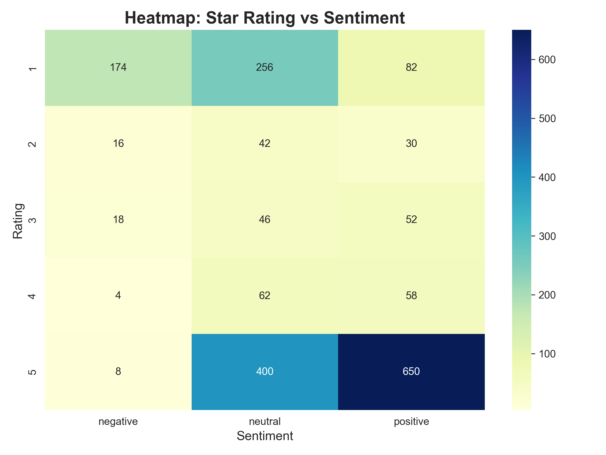
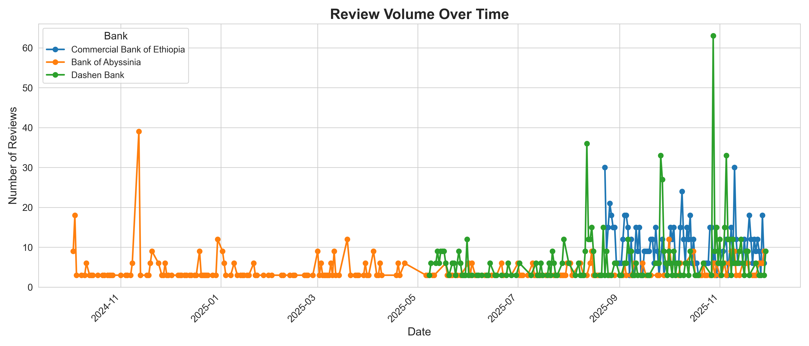
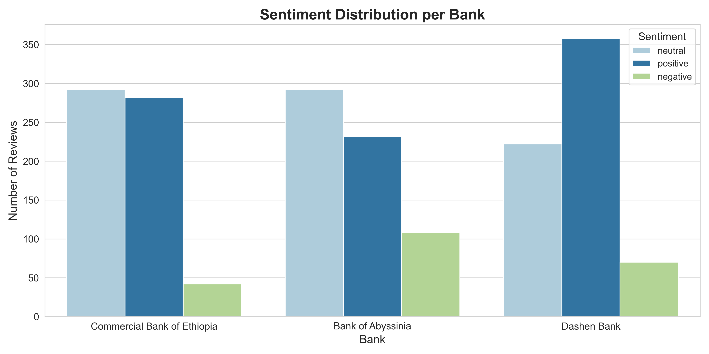
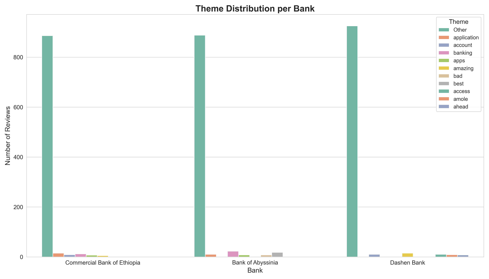

# Ethiopian Bank App Reviews – Week 2 Challenge

This repository contains scripts for scraping, preprocessing, sentiment and theme analysis, and database engineering for three Ethiopian banks’ mobile apps:

- Commercial Bank of Ethiopia (CBE)
- Bank of Abyssinia (BOA)
- Dashen Bank

The goal is to analyze customer satisfaction, identify app usage pain points, and provide actionable insights for improvement.

---

## Repository Structure

| Folder         | Description |
|----------------|-------------|
| `task-1/`      | Scraping and preprocessing scripts |
| `task-2/`      | Sentiment and thematic analysis scripts |
| `task-3/`      | PostgreSQL database insertion scripts |
| `task-4/`      | Insights, visualizations, and recommendations |
| `data/`        | Raw and cleaned datasets |

---

## Requirements

Install dependencies via `requirements.txt`. Key packages include:

- `pandas`
- `google-play-scraper`
- `textblob`
- `scikit-learn`
- `psycopg2-binary`

---

## Project Workflow

The analysis follows five main stages:

1. **Scraping (Task 1)** – Extract reviews, ratings, and dates from Google Play Store.
2. **Preprocessing (Task 1)** – Clean data, remove duplicates, normalize dates, and structure CSV.
3. **Sentiment & Theme Analysis (Task 2)** – Compute sentiment polarity, classify reviews, and extract recurring themes per bank.
4. **Database Insertion (Task 3)** – Store cleaned and enriched review data in PostgreSQL for structured access and querying.
5. **Insights & Recommendations (Task 4)** – Summarize results with visualizations, identify drivers and pain points, and recommend app improvements.

---

## Task 1: Data Collection and Preprocessing

* **Scripts:** `task-1/scrape_reviews.py`, `task-1/preprocessing.py`
* **Steps Completed:**
  - Scrape ~400 reviews per bank (~1,200 total)
  - Remove duplicates and handle missing data
  - Normalize dates (YYYY-MM-DD)
  - Output CSV: `task-1/clean_reviews.csv`
* **KPIs Achieved:** 1,200+ clean reviews collected, Git repo organized

---

## Task 2: Sentiment Analysis & Thematic Extraction

* **Script:** `task-2/sentiment_analysis.py`
* **Pipeline:**
  1. Load preprocessed CSV
  2. Compute sentiment polarity via TextBlob
  3. Classify as `positive`, `neutral`, or `negative`
  4. Extract top keywords using TF-IDF and group into preliminary themes
* **Output:** `task-2/reviews_sentiment_themes.csv`
* **KPIs Achieved:** All reviews scored, preliminary themes assigned, modular pipeline ready

---

## Task 3: PostgreSQL Database Insertion

* **Script:** `task-3/insert_reviews_postgres.py`
* **Database:** `bank_reviews`
* **Tables:**
  - `banks` (bank_id, bank_name, app_name)
  - `reviews` (review_id, bank_id, review_text, rating, review_date, sentiment_label, sentiment_score, theme, source)
* **Implementation:**
  - Map CSV bank codes to DB IDs
  - Insert multiple themes per review
* **KPIs Achieved:** >1,000 reviews inserted, schema documented

---

## Task 4: Insights & Recommendations (Preliminary)

* **Script:** `task-4/analyze_reviews.py`
* **Data:** `task-4/data/bank_review_summary.csv`

### Narrative Insights
- **CBE**: Users report slow transfers and occasional login failures.
  - Drivers: Fast navigation, responsive UI in positive reviews
  - Pain Points: Slow transfers, login issues
  - Recommendations: Optimize transfer APIs, improve login stability, maintain responsive UI

- **BOA**: Frequent complaints about login errors and app crashes.
  - Drivers: Good customer support responses
  - Pain Points: Login errors, app crashes
  - Recommendations: Enhance app stability, fix crash bugs, improve authentication flow

- **Dashen**: UI and performance mixed feedback.
  - Drivers: Clear interface, fast navigation
  - Pain Points: Some performance lag, occasional crashes
  - Recommendations: Optimize app performance, fix crash hotspots

### Verification Queries
- Review counts per bank verified
- Average ratings per bank verified
- Ensures database integrity for downstream analysis

### Plots

#### 1. Rating vs Sentiment Heatmap

#### 2. Review Timeseries

#### 3. Sentiment Distribution

#### 4. Theme Distribution

#### 5. Theme-Sentiment Heatmap

### Next Steps
- Aggregate statistics per bank
- Identify key drivers (e.g., fast navigation) and pain points (e.g., app crashes)
- Complete Task 4 report with insights and recommendations
- Finalize GitHub repo and prepare final report

---

## Status

| Task                                | Status        |
| ----------------------------------- | ------------- |
| Task 1 – Scraping & Preprocessing   | ✅ Completed   |
| Task 2 – Sentiment & Themes         | ✅ Completed   |
| Task 3 – PostgreSQL DB              | ✅ Completed   |
| Task 4 – Insights & Recommendations | ✅ Completed |

---

## References

* [google-play-scraper](https://github.com/JoMingyu/google-play-scraper)  
* [Pandas Documentation](https://pandas.pydata.org/pandas-docs/stable/)  
* [TextBlob](https://textblob.readthedocs.io/en/dev/)  
* [scikit-learn TF-IDF](https://scikit-learn.org/stable/modules/generated/sklearn.feature_extraction.text.TfidfVectorizer.html)  

---

**Author:** Mikiyas Dawit  
**Date:** December 2, 2025
